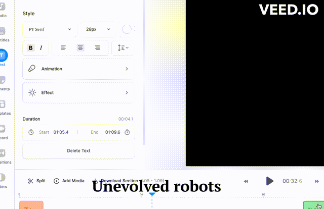
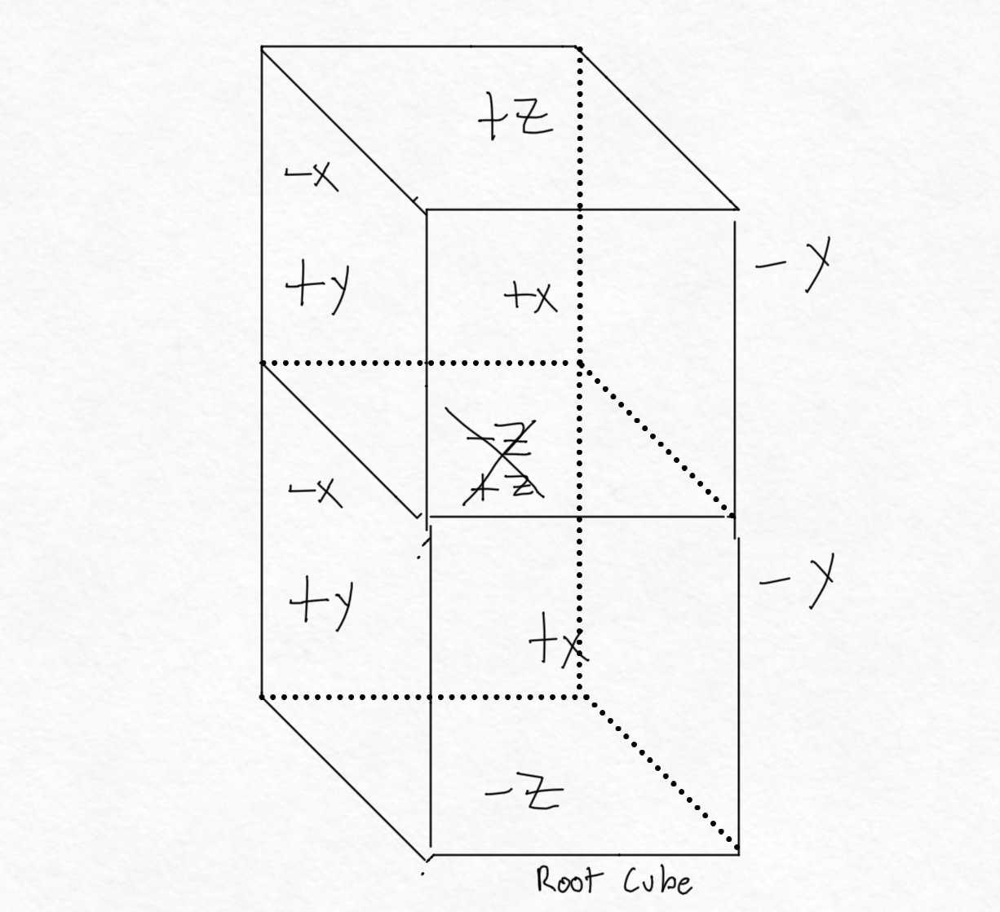
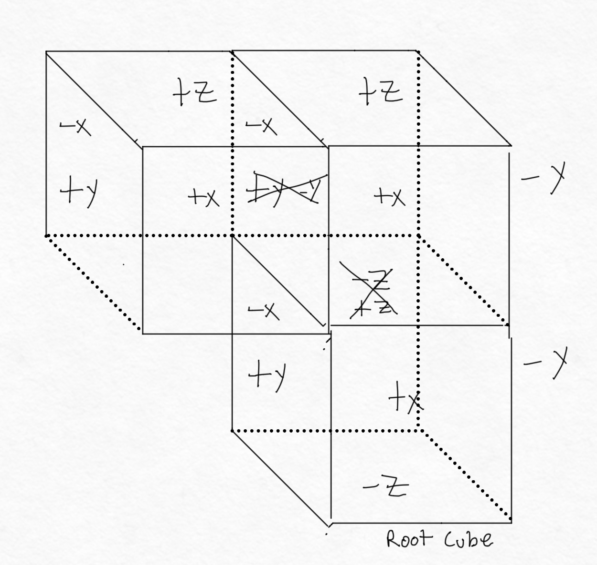
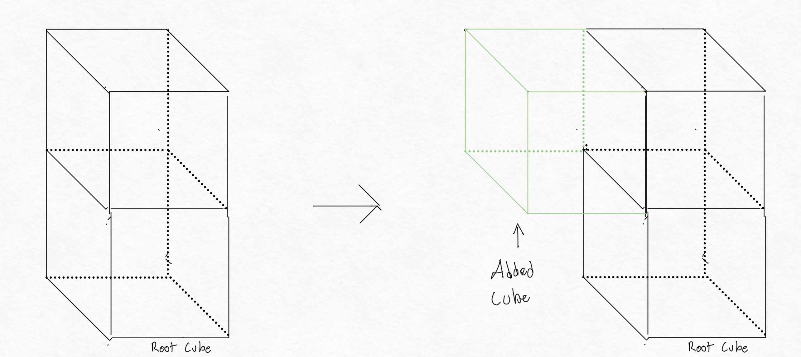
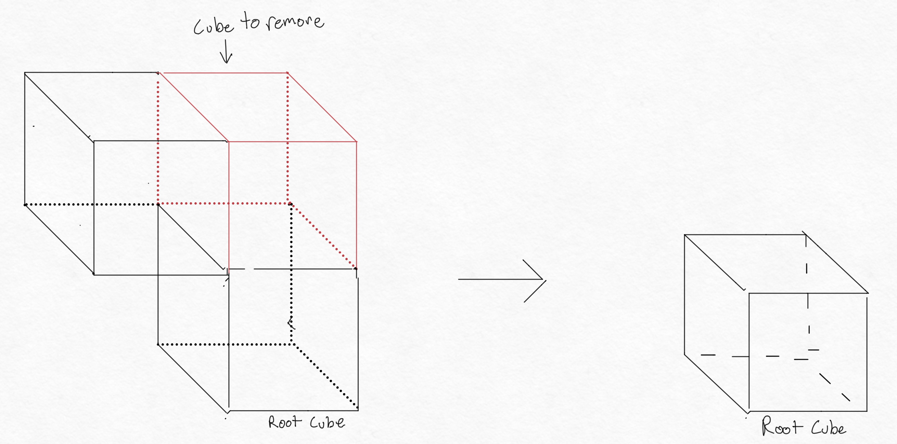
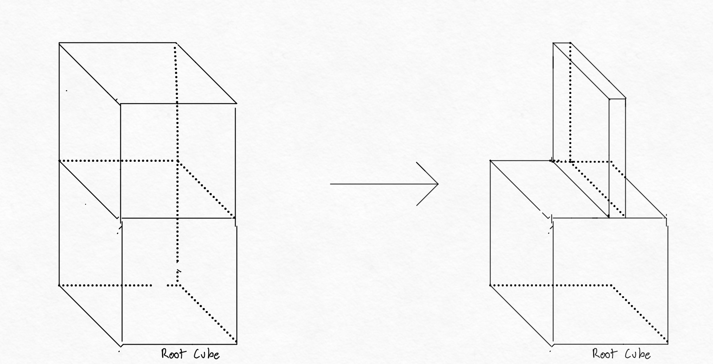
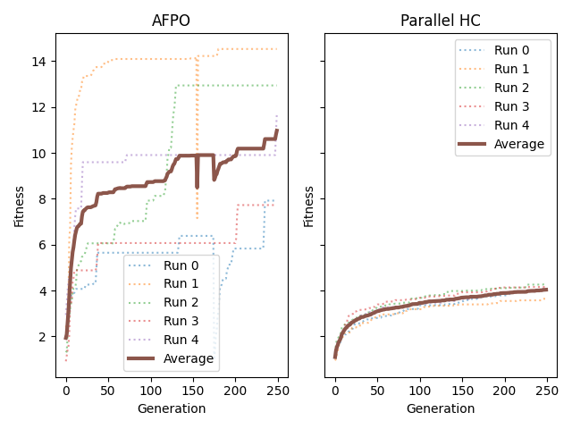

# 396 Artificial Life Final Project

## Table of Contents

- [396 Artificial Life Final Project](#396-artificial-life-final-project)
  - [Table of Contents](#table-of-contents)
  - [Viewing the Project](#viewing-the-project)
  - [Run Button](#run-button)
  - [Teaser Gif](#teaser-gif)
  - [2 minute Youtube video](#youtube-video)

  - [Project Overview](#project-overview)
    - [Robot Structure](#robot-structure)
      - [Body Generation](#body-generation)
      - [Brain Generation](#brain-generation)
    - [Evolution](#evolution)
    - [Simulation Parameters](#simulation-parameters)

  - [Results](#results)
    - [Hypothesis](#hypothesis)
    - [Inspiration](#inspiration)
    - [Experimental Design](#experimental-design)
    - [Experiment 1](#experiment-1)
    - [Experiment 2](#experiment-2)
    - [Discussion](#discussion)
    - [Conclusion](#conclusion)
    - [Future Work](#future-work)

  - [Rubric](#rubric)

## Viewing the Project

To view the most fit robots from every run, there is a utility file called SolutionViewer.py.

To view the top robot from each run, run the following command:

```python
python3 SolutionViewer.py
```

This will start with 5 random unevolved robots, then show you the most fit robot from each run.

## Run Button

To run the code to evolve the robots for the 5 experiments for both Evolutionary Selection Algorithms, run the following command:

```python
python3 experiment.py
```

This will not output any videos. In order to see the results, configure SolutionViewer to your liking and run it.
You can also run analyze.py to get the average fitness of the robots from each run.

---

## Teaser Gif



## Youtube Video

<video src="./images/396 Final 2 min.mp4" controls="controls" style="max-width: 730px;"></video>

---

## Project Overview

This project is built on top of pyrosim which is built on top of pybullet. [Pyrosim](https://github.com/jbongard/pyrosim) is a python wrapper that allows you to create robots in pybullet and then simulate them. Pybullet is a python library that allows you to create robots in a physics simulator.

The base of this project was built on top of the tutorials from [r/ludobots](https://reddit.com/r/ludobots)

The aim of this project is to experiment with different ways to evolve robots for different objectives and observe any emergent behavior that occurs.

### Robot Structure

Each robot is made up of a body and a brain. The body is made up of a chain of links that are connected by joints. The brain is a neural network that takes in sensor values and outputs motor values. The brain is connected to the joints of the body by synapses.

The robots follow the typical laws of physics, and cannot go below the floor.

#### Body Generation

The genotype for the robots can be represented as follows:

```text
[Number of links, Number of sensors, [Number of links attached to each face of the root link], Number of hidden layers in the neural network, Number of neurons in each hidden layer]
```

My implementation of the body generation is as follows:

1. Create a random number of links between 3 and 10.
2. Create a random number of sensors between 0 and 10.
3. Start with the root link, and its 6 available faces.
    - List of available faces on the root link for Fig 1: [+x, -x, +y, -y, -z]


4. It will randomly choose a face of all available faces to attach a link to.
5. The link will be attached to the face, and the face will be removed from the list of available faces.
    - Available faces for the root link: [+x, -x, +y, -y, -z]
    - Available faces for the new link: [+x, -x, +y, -y, +z]



6. For the rest of the links, they will choose a random link weighted by the number of available faces on each link, which encourages the robot to expand its body in all directions.
    - Available faces for the root link: [+x, -x, +y, -y, -z]
    - Available faces for the second link: [+x, -x, +y, +z]
    - Available faces for the third link: [+x, -x, -y, +z, -z]



7. Repeat steps 4-6 until all links have been attached.
8. Create a graph like structure of all of the links and which links connect to them.
9. After the connections have been created, the joints are generated between the links.
10. The brains are generated by creating a neural network with the number of sensors as input and the number of joints as output.
    - For this assignment, evolving was not required, so the neural network had 0 hidden layers
    - The sensors and motors were still fully connected

#### Brain Generation

The neural network's size is configurable, but the default is 3 hidden layers of 5 neurons each.

The root link of the body will never be removed through mutation and is colored red in order to distinguish it from the other links. The other links are colored according to whether or not they have a sensor. The links with a sensor are colored green and the links without a sensor are colored blue.
The number of sensors and motors is determined by the body randomly at the time of creation.

There is a configurable X% chance, (66% at time of writing) that a link will have a sensor attached to it. Whenever a link has a sensor attachewd to it The sensors emit -1 or 1 depending on whether the link is touching something or not. The motors are attached to the joints of the body and are used to control the joints.

The brains are fully connected from every sensor to every neuron in the next layer and then from the neurons in the next layer to every neuron in the next layer and so on until the last layer which is connected to every motor.

### Evolution

The evolution of the robots is done using a genetic algorithm. The genetic algorithm is a search algorithm that is used to find the best solution to a problem. The genetic algorithm is used to find the best robot for a given objective, or in most cases except for the final project, the goal is locomotion.

Every mutation has a configurable X%, (default 10%), chance of occurring. The mutations that can occur are as follows:

#### 1. Add a link to any available face



#### 2. Remove a link

- This will remove a link and all of its children



In this example, the link and its one child would be removed

#### 3. Change the shape of a link in any dimension



The example only shows one dimension being changed, but all more than 1 dimension could be changed in a single generation

#### 4. Change a neuron at random

Every neuron in the neural network has a configurable X%, (default 10%), chance of having the weight changed. The weight can be changed to any random amount between -1 and 1.

### Simulation Parameters

For the main results shown in this experiment, they were run with 5 different seeds for 250 generations with a 20 population size. The simulation parameters are as follows:

- 5 seeds per selection method (0-4)
- 250 generations
- 20 population size
- 50000 sim count per selection method
- 10% mutation rate
- 66% sensor rate
- 3 hidden layers of 5 neurons each

---

## Results

### Hypothesis

My experiment was centered around different ways to evolve the robot population over time.

I chose to integrate AFPO because it was on the initial reddit page of interesting projects, and I wanted something better than hill climbing but that didn't use crossover.

My hypothesis is that AFPO will be better at finding a population that can locomote better than the hill climbing algorithm.

Because it allows multiple variations of the same robot to exist in the population, I hypothesize that it will be better at finding a population that can locomote better than the hill climbing algorithm, rather than having a fixed set of robots that are only mutated.

### Inspiration

My inspiration was the reddit page suggesting interesting projects. I have never dealt with Paredo Optimization before, so I wanted to try it out. I also asked some friends in Econ and IEMS, and they knew what a paredo front was, but not in this specific context. Multi objective optimization is a very interesting topic, and I wanted to learn more about it, especially when given the opportunity to do so through a class.

### Experimental Design

I had to make some compromises due to simulation length. I wanted to still meet the 2x50,000 sim count, but I also wanted to have a large enough population to get a good sample size. I decided to use 20 population size and 250 generations. I also wanted to have 5 seeds per selection method, so I could get a good sample size of the results.

#### Experiment 1

The first experiment was running the Hill Climber for all 5 runs. See Figure 1 for the results.

We see slow and steady improvement over time. There is no crossover between generations, so the population is not able to explore new solutions. The population is only able to improve the solutions that it already has. I view this as the ultimate failure of this algorithm and is why I chose to initially test AFPO.

#### Experiment 2

The second experiment was running AFPO for all 5 runs. See Figure 1 for the results.

We see that AFPO is able to find a better solution than the Hill Climber. The Hill Climber is able to find a solution that can locomote, but it is not able to find a solution that can locomote well. AFPO is able to find a solution that can locomote well, while maintaining a diversity of population.

See the best robot from each run below:



### Discussion

The results of the experiment show that AFPO is able to find a better solution than the Hill Climber. If I had more time, I would do statistical tests of the change in fitness over time, along with the overall fitness of the population. I would also like to test other selection methods, such as NSGA-II, to see how they compare to AFPO.

I would also like to see the results of the experiment with a larger population size and more generations. I would like to see if the population is able to find a better solution with more time to explore the solution space.

Given that AFPO makes more bad solutions than hill climber, having a larger population size would allow the population to explore more solutions, and hopefully find a better solution. I would imagine that AFPO would perform worse given smaller population sizes, and I would like to test that hypothesis.

### Conclusion

I was able to test my hypothesis that AFPO would be better at finding a population that can locomote better than the hill climbing algorithm. While this was not statistically verified, I believe that the runs would have shown that AFPO was statistically significantly better than the Hill Climber.

### Future Work

The first priority would be making the result data set more robust. 

## Rubric

- [x] 1pt (4 pts): Executable code + saved data of best robots (files, pickles, checkpoints, etc.)
    Use the [#Run Button](#run-button) to start evolution and see [#Viewing the Project](#viewing-the-project) for more information

- [x] 1 pt (4 pts): Sufficient sim count
    See [Simulation Parameters](#simulation-parameters) for more information

- [x] 1 pt (4 pts): Follow the laws of physics
    See [Robot Structure](#robot-structure) for more information

- [x] 4 pts (8 pts): The 2 min summary video.
    See [2 minute Youtube video](#youtube-video) for more information
  - [x] hypothesis
  - [x] inspiration
  - [x] experiment
  - [x] results
  - [x] blooper reel at the end, of silly, strange, and diverse bots.

- [x] 2 pts (3 pts): The 10 sec teaser gif.
    See [Teaser Gif](#teaser-gif) for more information

- [x] 1 pt (3 pts): What is the hypothesis? Inspiration? Why should we care? Picture? Cartoon?
    See [Hypothesis](#hypothesis) for more information.

- [x] 2 pt (6 pts): How did you test it? Experimental design? Control experiment: how did you isolate the variable of interest? Where is the code for this? Draw a cartoon.
    See [Experimental Design](#experimental-design) for more information

- [ ] 1 pt (3 pts):
  - [ ] Cartoons of the genotype-to-phenotype map
  - [x] Cartoons of mutations (explain all the ways to make offspring and how they can be dis/similar to parents),
  - [ ] Cartoons of selection (how does the parallel hill climber or whatever algo you use, work?)
    See [Evolution](#evolution) for more information

- [x] 1 pt (3 pts): Results? What did you find?
    See [Discussion](#discussion) for more information

- [x] 1 pt (3 pts): How did you dig further into a detail of the results? Additional analysis? Diagrams/plots/data/stats?
    See [Discussion](#discussion) for more information
    I also used SolutionViewer.py and SolutionDebugger.py to dig into the results from the experiment to ensure that the algorithm was working correctly. parallelHillClimber also has a Show_Fitness_Graph function that can be used to view the fitness of each member of the population over time for an individual run.

- [x] 1 pt (3 pts): Discussion and conclusion. What would you do if you had more time?
    See [Discussion](#discussion) and [Conclusion](#conclusion) and [Future Work](#future-work) for more information
