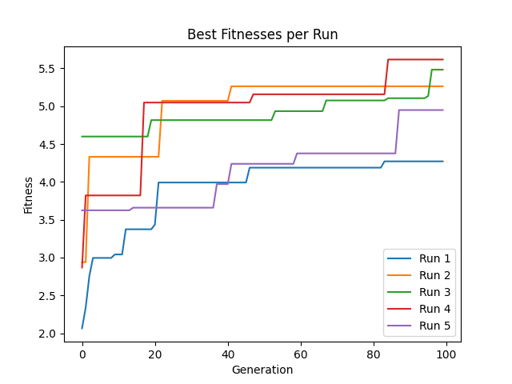
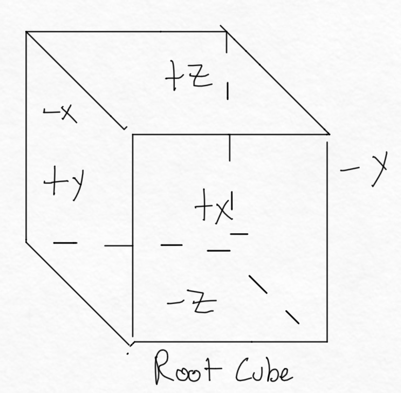

# Isaac Miller

## Run Button

To run the code, you can clone the repo, switch to the 'assignment-8' branch, and run the following command:

```
python3 search.py
```

This will show ten unevolved creatures, then evolve them for X generations, and then show the best 10 creatures from each generation.

---

## Project Overview

This project is built on top of pyrosim which is built on top of pybullet. [Pyrosim](https://github.com/jbongard/pyrosim) is a python wrapper that allows you to create robots in pybullet and then simulate them. Pybullet is a python library that allows you to create robots in a physics simulator.

The base of this project was built on top of the tutorials from [r/ludobots](https://reddit.com/r/ludobots)

The aim of this project is to experiment with different ways to evolve robots for different objectives and observe any emergent behavior that occurs.

### Robot Structure

Each robot is made up of a body and a brain. The body is made up of a chain of links that are connected by joints. The brain is a neural network that takes in sensor values and outputs motor values. The brain is connected to the joints of the body by synapses.

See [Assignment 7](#assignment-7) for more information on the body generation.

The neural network's size is configurable, but the default is 3 hidden layers of 5 neurons each.

The root link of the body will never be removed through mutation and is colored red in order to distinguish it from the other links. The other links are colored according to whether or not they have a sensor. The links with a sensor are colored green and the links without a sensor are colored blue.
The number of sensors and motors is determined by the body randomly at the time of creation.

There is a configurable X% chance, (66% at time of writing) that a link will have a sensor attached to it. Whenever a link has a sensor attachewd to it The sensors emit -1 or 1 depending on whether the link is touching something or not. The motors are attached to the joints of the body and are used to control the joints.

### Evolution

The evolution of the robots is done using a genetic algorithm. The genetic algorithm is a search algorithm that is used to find the best solution to a problem. The genetic algorithm is used to find the best robot for a given objective, or in most cases except for the final project, the goal is locomotion.

Every mutation has a configurable X%, (default 10%), chance of occurring. The mutations that can occur are as follows:

#### 1. Add a link to any available face


#### 2. Remove a link

- This will remove a link and all of its children


In this example, the link and its one child would be removed

#### 3. Change the shape of a link in any dimension


The example only shows one dimension being changed, but all more than 1 dimension could be changed in a single generation

#### 4. Change a neuron at random

Every neuron in the neural network has a configurable X%, (default 10%), chance of having the weight changed. The weight can be changed to any random amount between -1 and 1.

---

# Old Assignments

Everything past this point is an archive to view the development progression of the project.

---

## Assignment 8

### Overview

For this assignment, we were tasked with adding evolution to the newly created 3D morphologies that were created in assignment 7.

A rough genotype for these new robots can be represented as follows:

```
[Number of links, Number of sensors, [Number of links attached to each face of the root link], Number of hidden layers in the neural network, Number of neurons in each hidden layer]
```

### Experiment

We were tasked with running 5 experiments and tracking the fitness of the best robot in each experiment.
All robots had 3 layers of 5 neurons each in their neural network.

The experiments were all 100 generations of 20 robots each.

#### The results were as follows


---

## Assignment 7

### Overview

For this assignment, we were tasked with changing the 1D snake morphology to a 3D morphology.
I decided to only use cubes rather than randomly sized rectangular prisms. The reason is so that it was easier to prevent the robot from self intersecting. A way to solve this would be to keep a record of all 3d space that has been filled and make sure that the space that the robot is trying to fill is not already filled. This would be a good way to solve this problem, but I decided to not do it because I wanted to focus on the 3D morphology.

My implementation of the 3D morphology is as follows:

1. Create a random number of links between 3 and 10.
2. Create a random number of sensors between 0 and 10.
3. Start with the root link, and its 6 available faces.
    - List of available faces on the root link for Fig 1: [+x, -x, +y, -y, -z]



4. It will randomly choose a face of all available faces to attach a link to.
5. The link will be attached to the face, and the face will be removed from the list of available faces.
    - Available faces for the root link: [+x, -x, +y, -y, -z]
    - Available faces for the new link: [+x, -x, +y, -y, +z]


6. For the rest of the links, they will choose a random link weighted by the number of available faces on each link, which encourages the robot to expand its body in all directions.
    - Available faces for the root link: [+x, -x, +y, -y, -z]
    - Available faces for the second link: [+x, -x, +y, +z]
    - Available faces for the third link: [+x, -x, -y, +z, -z]


7. Repeat steps 4-6 until all links have been attached.
8. Create a graph like structure of all of the links and which links connect to them.
9. After the connections have been created, the joints are generated between the links.
10. The brains are generated by creating a neural network with the number of sensors as input and the number of joints as output.
    - For this assignment, evolving was not required, so the neural network had 0 hidden layers
    - The sensors and motors were still fully connected

### Video

Here is a video of 10 random unevolved morphologies:
[Youtube Link](https://youtu.be/z5tlp21Z5YE)

### Tasks

- [X] do it.

- [X] your GitHub repo needs to be public, linked to the correct branch, and well documented.

- [X] the readme should contain a diagram illustrating how bodies/brains are generated (pen and paper is fine if legible).

- [X] the readme should be concise but not a single sentence, and not a wall of text, it should explain what the codebase is and how it works, and cite relevant sources.

- [X] bodies can, in principle, fill 3d space (they are not just 3 perpendicularly intersecting snakes in +/- x,y,z.

- [X] Don't forget to keep your videos to 10 sec and show multiple bodies in the sim. Otherwise how do we know it doesn't just produce a single body?

- [X] Finally, bodies should be contiguous, able to fill 3D space (i.e. they should not be three perpendicularly intersecting snakes), and should obey the laws of physics: limbs should protrude into free space; they should not self-intersect on top of one another (if in doubt, compare to Sims').

---

## Assignment 6

### Overview

The snakes seen in this experiment have the following qualities:

1. They are made up of a chain of links of a random length between 3 and 10.
2. Each link has a 66% chance of having a sensor attached to it.
3. The brain of the snake is a neural network with the sensored links as input and all link motors as output. The neural network has 3 hidden layers of 5 neurons each.
4. To mutate each brain, every neuron is mutated with a 10% chance of being mutated. The mutation is a random number between -1 and 1.
5. To mutate each body, 10% of the dimensions of each link are mutated to be a random number from 0.3 to 1.
6. The fitness function is the average distance from the center of the screen of the head of the snake in the +x and +y direction.

### Tasks

- [x] random number
- [x] randomly shaped links
- [X] random sensor placement along the chain.
- [x] Links with and without sensors should be colored green and blue, respectively.

## Video

This video contains 5 random unevolved snakes, and then 5 evolved snakes after 50 generations.
[Youtube Link](https://youtu.be/DQLIAmM41Ck)

---

## Assignment 5

### Overview

What I decided to do with this project was to do the following objectives taken from the Ludobots reddit:

1. Sit. Good dog.

The robot I created is roughly modeled after the Boston dynamics dog.
It proved to be very difficult to get the robot to get its legs straight.
I exhibited selective pressure by having my fitness function encourage the robot to keep its upper legs off of the ground, its lower legs on the ground, and its torso off the ground.

2. Braniac
I implemented the neural network that was given to us in the assignment. I used the same fitness function as the previous objective.

From my testing, having the neural network does not make much if any of a performance difference. The beauty of neural networks is their ability to do backpropagation, which allows them to learn from their mistakes. However, in this case, the robot is not learning from its mistakes, it is just randomly searching the space and randomly mutating. This means that the robot is not learning from its mistakes, and therefore, the neural network is not helping it. There is also more dilution of neurons that can be mutated, and because of this, the robot is less likely to mutate into a better solution.

3. Not on the reddit

I did implement a custom mutator that scales with the number of weights in the neural network which helps to solve the issue of dilution. There is now a constant in the constants file called 'MUTATION_RATE' which is the probability that a weight will be mutated. This is multiplied by the number of weights in the neural network, so that the more weights there are, the more likely a weight will be mutated. This helps to solve the issue of dilution, but it does not solve the issue of the robot not learning from its mistakes.

## Video

Here is the gif of the robot evolving:


